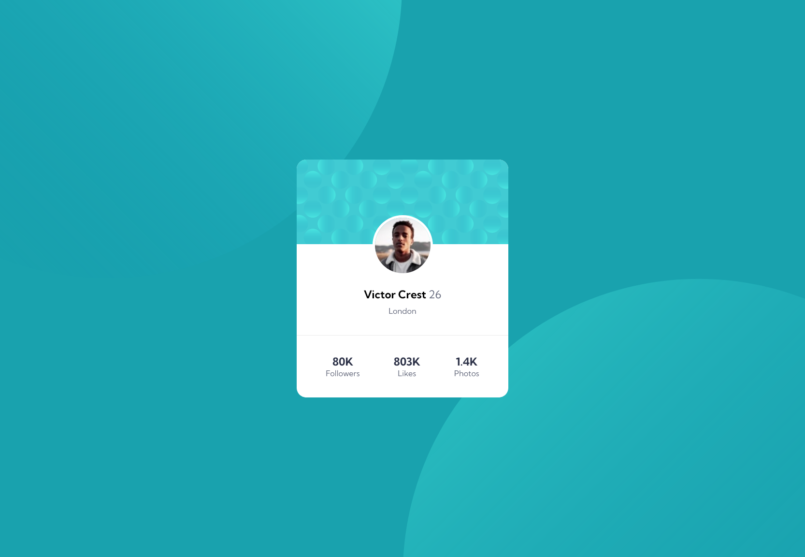

# Frontend Mentor - Profile card component solution

This is a solution to the [Profile card component challenge on Frontend Mentor](https://www.frontendmentor.io/challenges/profile-card-component-cfArpWshJ). Frontend Mentor challenges help you improve your coding skills by building realistic projects. 

## Table of contents

- [Overview](#overview)
  - [The challenge](#the-challenge)
  - [Screenshot](#screenshot)
  - [Links](#links)
- [My process](#my-process)
  - [Built with](#built-with)
  - [What I learned](#what-i-learned)
  - [Continued development](#continued-development)
  - [Useful resources](#useful-resources)
- [Author](#author)
- [Acknowledgments](#acknowledgments)

**Note: Delete this note and update the table of contents based on what sections you keep.**

## Overview

### The challenge

- Build out the project to the designs provided

### Screenshot

### Links

- Solution URL: [Add solution URL here](https://www.frontendmentor.io/solutions/profile-card-using-css-SkIvhmaI5)
- Live Site URL: [Add live site URL here](https://inkfromblood.github.io/frontendmentor-profile-card/)

## My process

### Built with

- Semantic HTML5 markup
- CSS custom properties
- Flexbox

### What I learned

I learned about building a background image from multiple pieces. 
The positioning isn't perfect, but in the end it works.
Again, another situation where I think it'd just be easier to create a single image in photoshop.

This was really more practice on the use of reducing the amount of code used, and using flexbox with more confidence.

## Author

- Website - Dan Bennett
- Frontend Mentor - [@inkfromblood](https://www.frontendmentor.io/profile/inkfromblood)
- Twitter - [@yourusername](https://www.twitter.com/inkfromblood)
